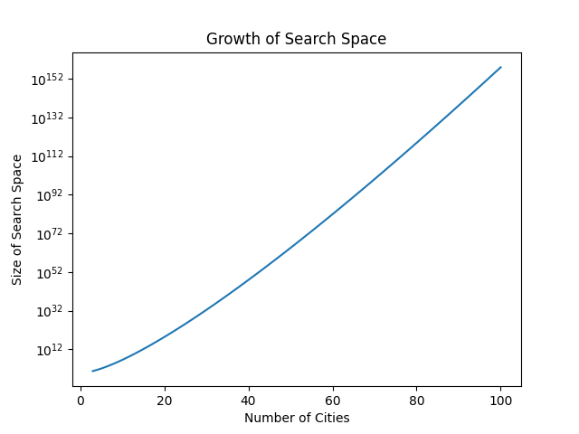

## Solve the Travelling Salesman Problem to Find the Optimal Driving Route by Genetic Algorithm

### What is the Travelling Salesman Problem (TSP)?
Definition: *Given a list of cities and the distances between each pair of cities, what is the shortest possible route that visits each city exactly once and returns to the initial city? (Gutin & Punnen, 2007)*

 Source: https://sketchplanations.com/the-travelling-salesman-problem

The TSP is a combinatorial optimization problem, which has a high complexity and having a search space of n!. The following plot shows how the search space increases exponentially with the number of cities. 

Obviously, it's not feasible to use the brute-force method enumerating all combinations and compute their distances, as it may take too much computational time.

### Optimization Algorithms
In order to solve this problem, optimization algorithms can help us with finding the optimal solution. For the traditional approaches in solving the TSP, integer programming (Miller et al, 1960) and dynamic programming (Bellman, 1962) were proposed to solve the TSP by finding the exact solution. However, they fail to search for the exact solution within practical timeframe due to scalability.

Later, heuristic algorithms were developed to tackle larger instances of TSPs. They are algorithms that focus on local search mechanisms and design, which the nearest neighbor algorithm (Rosenkrantz et al., 1977) is a popular one. Moreover, they aim to provide near-optimal solution instead of exact solution, but stuck in local optima when solving larger instances of TSPs.

Start from the 2000s, methodologies of solving TSPs have been shifted towards metaheuristics, which are advanced heuristic algorithms to address scalability issue, with high efficiency. Recently, various hybrid metaheurisitcs were proposed by mixing combining different metaheurisitc algorithms to solve the TSP and other optimization problems. Unlike heurisitic algorithms, metaheurisitic does not require gradient information, which we don't need to have prior knowledge in the problem. And this is beneficial when dealing with lots of TSPs or complex optimization problems.

### File Description
- GA.ipynb is a document along with python codes, comments and markdowns of full explanation, as a notebook.
- 50_Landmarks.csv contains coordinates and addresses of the 50 waypoints.
- 50_Landmarks_Distance_Matrix.csv contains the 2500 distances data of the 50 waypoints.
- Best_route.html is an interactive map showing the driving route through 50 waypoints computed by GA.
